# **University of Pennsylvania, CIS 565: GPU Programming and Architecture, Project 4:**

# **CUDA Rasterizer**

Tested on: Windows 10, Intel Core i7-7700HQ CPU @ 2.80 GHz, 8GB RAM, NVidia GeForce GTX 1050

       

- [Features](#features)

- [In-Depth](#indepth)

- [Time Analysis](#time_analysis)

- [Bloopers](#bloopers)
 

 

____________________________________________________

 
The goal of this project was to run an algorithm that clears out all zeros from an array on the GPU using CUDA. This parallel reduction is done using the scan algorithm that computes the exclusive prefix sum. I also implemented a parallelized Radix Sort using the exclusive prefix sum algorithm developed.

### Things Done

#### Core Features

 - [x] Everything

 #### What Makes Me Special
 
  - [x] Perspective Correct Color Interpolation
  - [x] Instancing
  - [x] Super-Sampled Anti-Aliasing

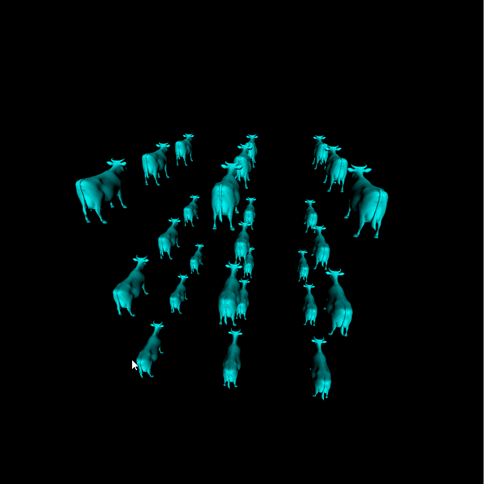

### In-Depth:

#### Perspective Correct Color Interpolation

It is important to always correctly interpolate the color at each vertex, and so I did.

Here is what a triangle that is leaning back from the camera looks like without perspective correct interpolation and with (side-by-side):

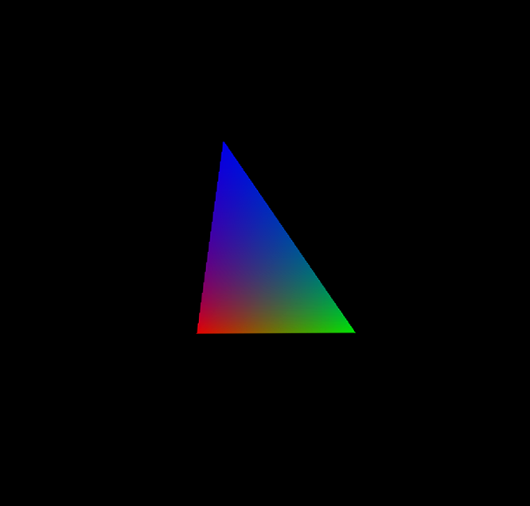 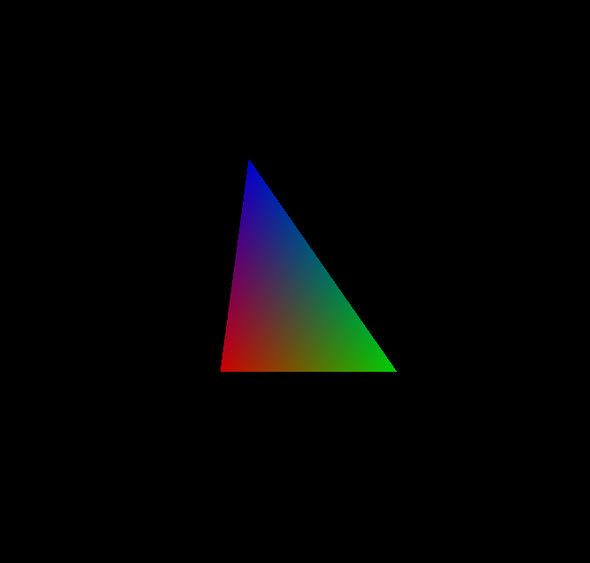

Here they are in a nice GIF format that shows them back to back. (As with most color-dense GIFs, the colors are reduced for recording purposes, the colors in real life are exactly as they in the pictures above)

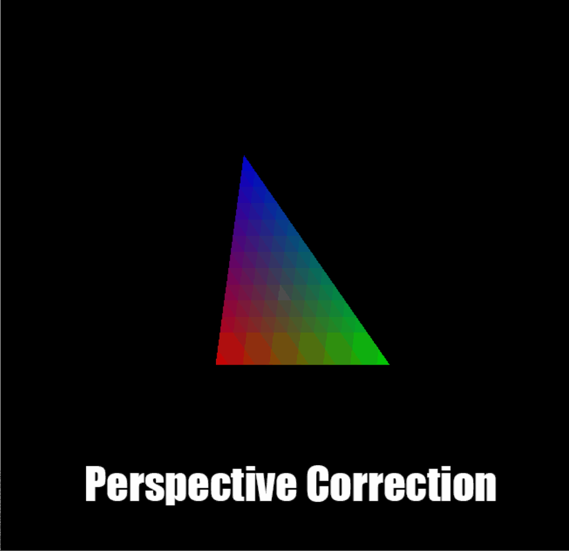

As you can see in this very quantized GIF, there is a lot more blue in the triangle without the interpolation because the Z depth is not correctly interpolated!

#### Instancing

For instancing I added a preprocessor macro, `num_instances`, that defines the number of times that you want a mesh to be instanced. I then have a hard-coded array of transformation matrices that represent the transformations of each instance.

In the vertex shader, I loop over each instance and then transform each vertex `num_instances` times to correspond to the appropriate instance transformation.

I then go through the rest of the primitive rasterization as normal, with `num_instances * numPrimitives` primitives instead of the usual `numPrimitives`.

Here is what it looks like with the cow instanced 9 times:

and here is what it looks like with it instanced 27 times!!

#### Super-Sampled Anti-Aliasing:

For the super-sampled anti-aliasing (SSAA), multiply the fragment buffer by the preprocessor macro `SSAA_RES` which defines the scaling that each axis (`width`, `height`) is scaled by.

Here are the results, with FPS listed in the window title.

##### AA 1x1 (No anti-aliasing)

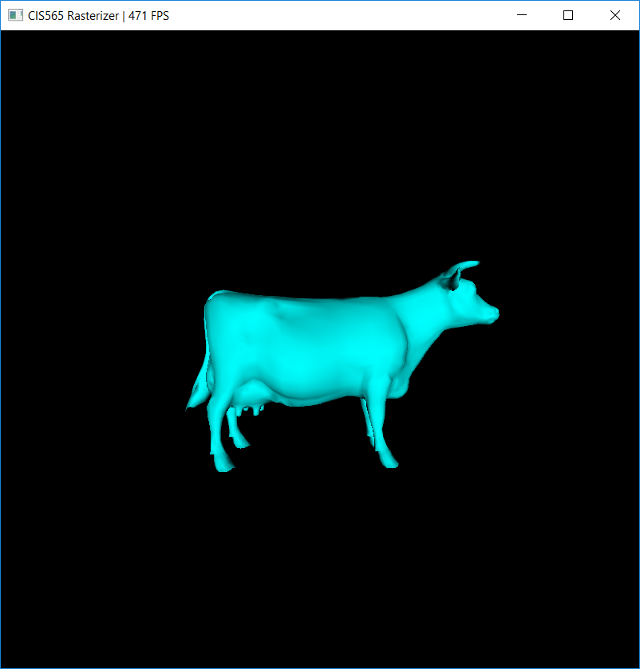

##### AA 2x2

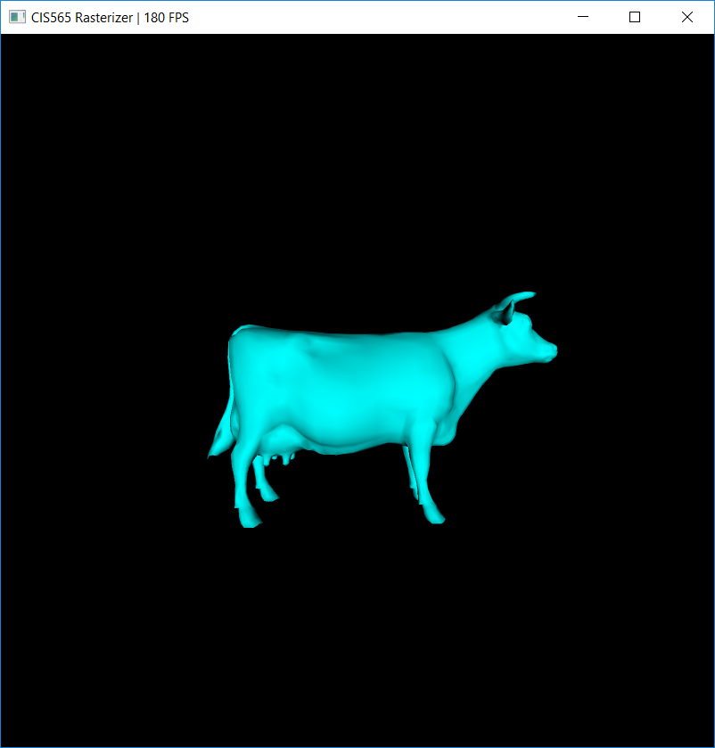

##### AA 4x4

##### AA 8x8

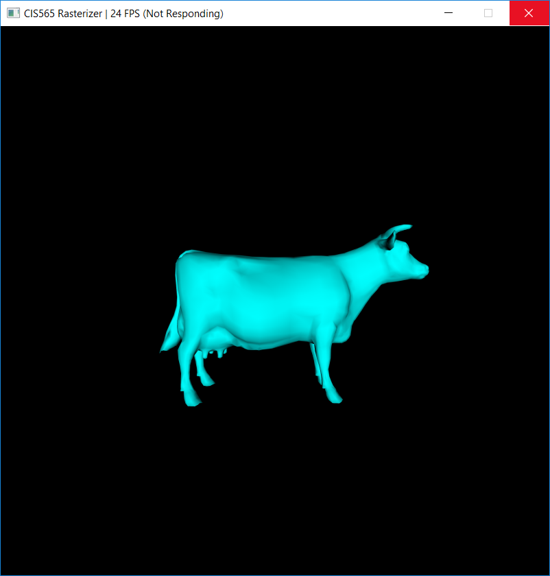

### Time Analysis

I have time analyses for two major aspects that I implemented AA and Instancing. Instancing scaled pretty much very nicely. Considering I was scaling by O(n^3) each time, the time almost doubled every time, so that's a linear increase in time, which actually means my instancing is actually < O(n). That is cool.

Here is a stacked graph also showing the absolute time (in ms):

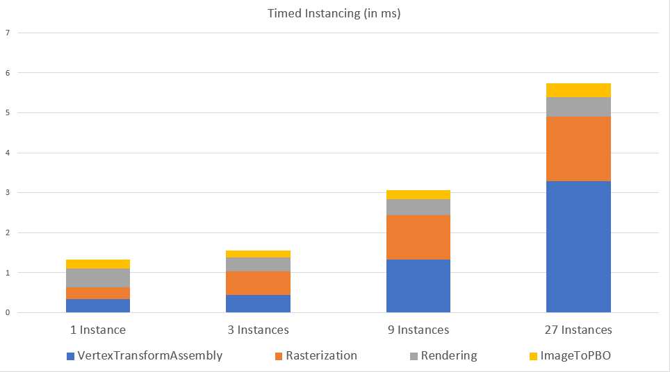

As you can see, the time doubles even though I'm tripling the number of cows in each time step.

Here is that same graph showing just percentages

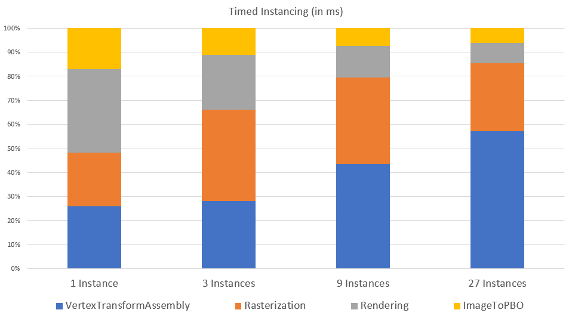

As you can see, because all the work is done int the vertex shader (vertex transform and assembly) stage, the time it takes to transform the vertices gradually becomes the bottleneck.

With AA, the time scaled up very evenly and the bottleneck here was rasterization of course. Here is an absolute time (in ms) stacked graph of that:

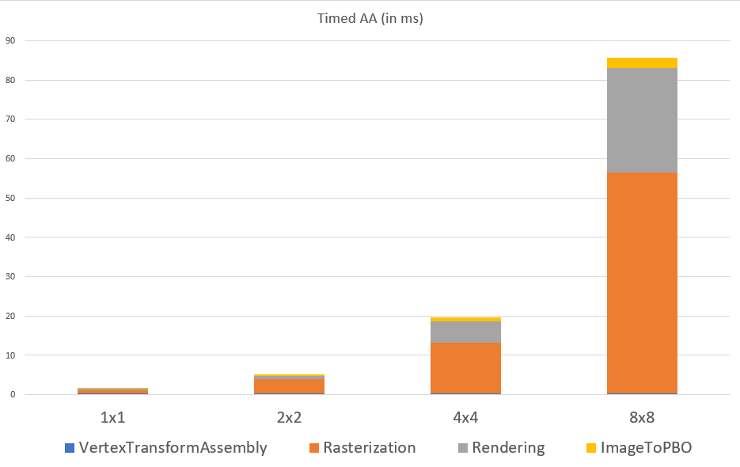

The time increases evenly as I double my n every time, as such this means my AA is actually O(n^2), which is what you'd expect since I am literally sampling n^2 every time. In the 100% stacked bar graph it is very clear how much the rasterization becomes a factor as we scale. (Also note that the vertex shader becomes more and more irrelevant)

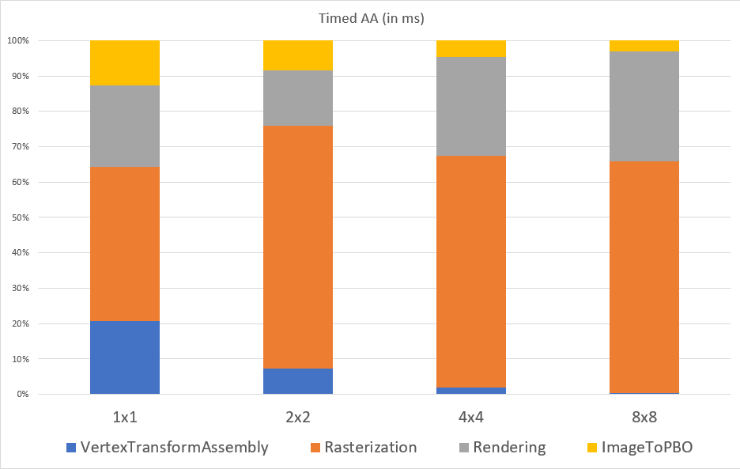

### Bloopers

My best bloopers were mainly while creating the base render. I tried rendering using many debug views with varying levels of success. Here are some of my favorite.

##### "Neon Cow"

I was trying to rasterize the cow with normals showing, a depth buffer bug caused this beauty:

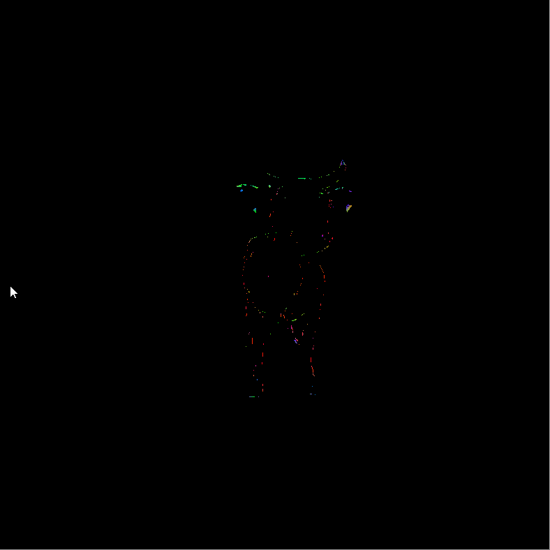

##### "The Cow Sees All"

I was trying to again modify the depth buffer, reversed the depth check and got this creepy situation where the cow follows you around if you move the camera in a certain angle:

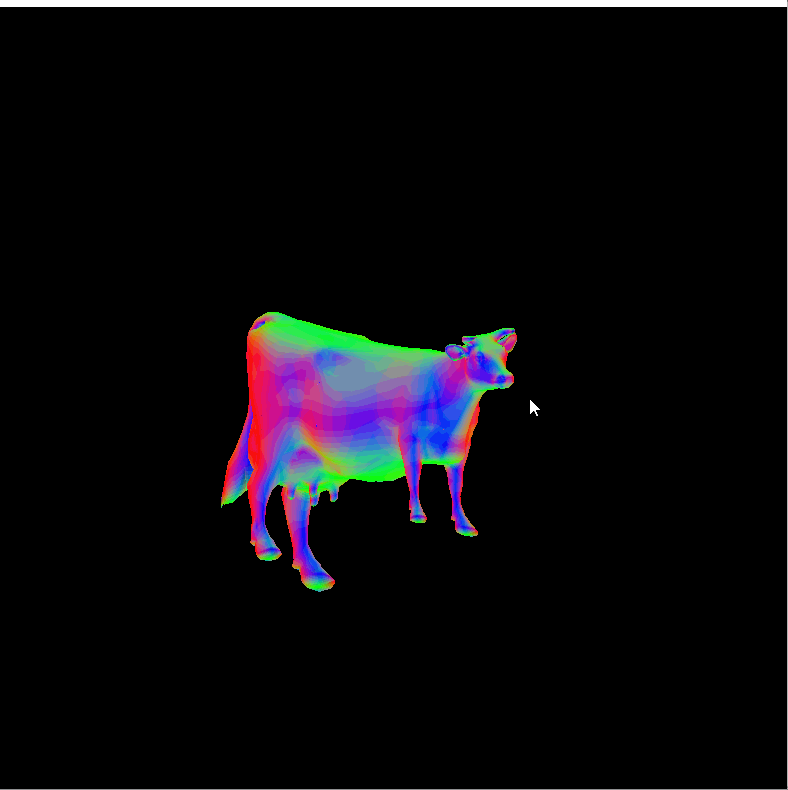

##### "Debug View: Eye Space Normal"

Here is a nice debug view of the cow with camera-space normals, the color segmentation is due to the GIF recording software reducing the color palette:

